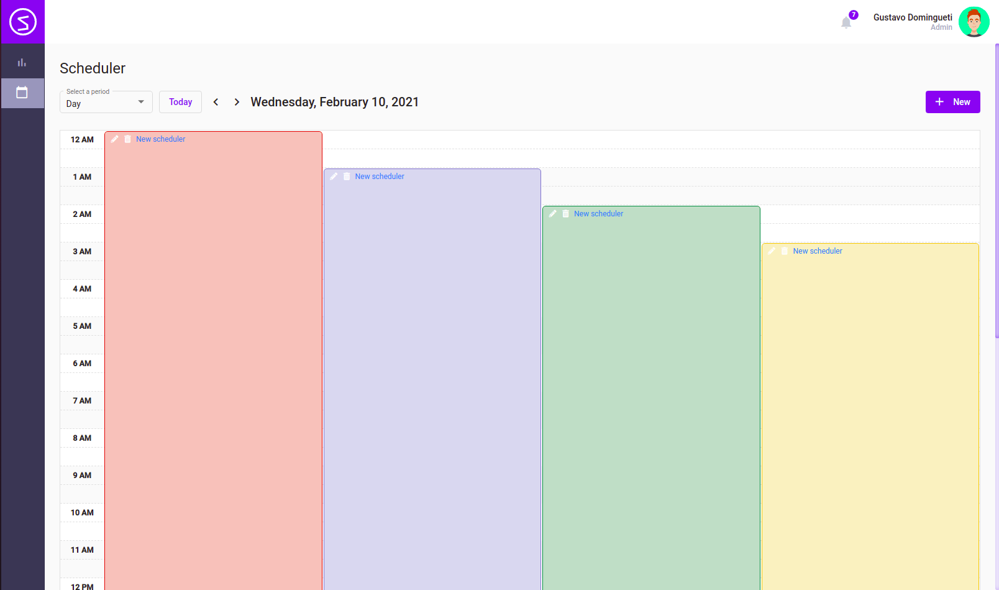
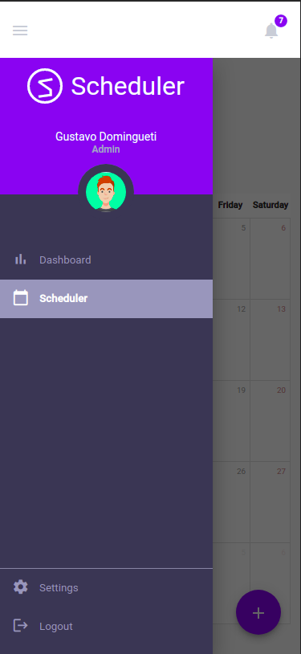

<h1>Scheduler</h1>

<h3 align="center">
    <b>Schedule messages to your contacts!</b>  
    <br>
</h3>

<p align="center">
  <a href="https://nodejs.org/en/" target="_blank">
    
  </a>
  <a href="https://www.npmjs.com/" target="_blank">
    
  </a>
  <a href="https://www.angular.io.com/" target="_blank">
    
  </a>
  <a href="https://www.linkedin.com/in/gustavodomingueti/" target="_blank">
    
  </a>
</p>

<p align="center">
  <a href="#about">About</a>&nbsp;&nbsp;&nbsp;|&nbsp;&nbsp;&nbsp;
  <a href="#access-links">Access links</a>&nbsp;&nbsp;&nbsp;|&nbsp;&nbsp;&nbsp;
  <a href="#technologies">Technologies</a>&nbsp;&nbsp;&nbsp;|&nbsp;&nbsp;&nbsp;
  <a href="#how-to-use">How to use</a>&nbsp;&nbsp;&nbsp;|&nbsp;&nbsp;&nbsp;
  <a href="#how-to-contribute">How to contribute</a>&nbsp;&nbsp;&nbsp;|&nbsp;&nbsp;&nbsp;
  <a href="#license">License</a>
</p>

<h3 align="center">
  <a
    href="https://ps-scheduler.vercel.app"
    target="_blank"
  >Acess the demo</a>
</h3>

<a id="about"></a>

## :bookmark: About

The <strong>Scheduler</strong> is a Web and Mobile application to help people schedule messages that will be sent to some contacts (the contacts can be informed by importing a csv file with the list of phone numbers or can be done by adding manually) for a certain day (s) and right time.

<a id="access-links"></a>

## :link: Access links

- [Demo](https://ps-scheduler.vercel.app)
- [Figma](https://www.figma.com/file/syUya1xUMjDSNw4Luh8CI2/Scheduler?node-id=0%3A1)

<a id="technologies"></a>

## :rocket: Technologies and libraries

The project was developed using the following technologies and libraries:

- [TypeScript](https://www.typescriptlang.org/)
- [Angular](https://angular.io/)
- [Rxjs](https://www.learnrxjs.io/)
- [Sass](https://sass-lang.com/)
- [Lodash](https://lodash.com/)

## :heavy_check_mark: :computer: Desktop Result

<h1 align="center">
    
    
    
    
    
    
</h1>

## :heavy_check_mark: :iphone: Mobile Result

<h1 align="center">
    
    
    
    
    
    
    
</h1>

<a id="how-to-use"></a>

## :fire: How to use

- ### **Prerequisites**

  - It is **necessary** to have **[Node.js](https://nodejs.org/en/)** installed on the machine in the lts version.
  - Also, you **need** to have a package manager be it **[NPM](https://www.npmjs.com/)** or **[Yarn](https://yarnpkg.com/)**.

1. Do a clone:

```sh
  $ git clone git@github.com:dominguetigs/ps-scheduler.git
```

2. Running the Application:

```sh
  # Install the dependencies
  $ npm install

  # Initialize the application
  $ npm run start:open

  # If you want to run externally on a mobile device
  $ npm run start:host

  # Tests
  $ npm run test

  # Build
  $ npm run build
```

<a id="how-to-contribute"></a>

## :recycle: How to contribute

- Fork this repository
- Create a branch with your feature: `git checkout -b my-feature`
- Commit your changes: `git commit -m 'feat: My new feature'`
- Push your branch: `git push origin my-feature`

## :memo: License

This project is under the MIT license. See the [LICENSE](LICENSE.md) file for more details.

---

<h4 align="center">
    Done with 💙 by <a
      href="https://www.linkedin.com/in/gustavodomingueti/"
      target="_blank"
    >Gustavo Domingueti</a>
</h4>
